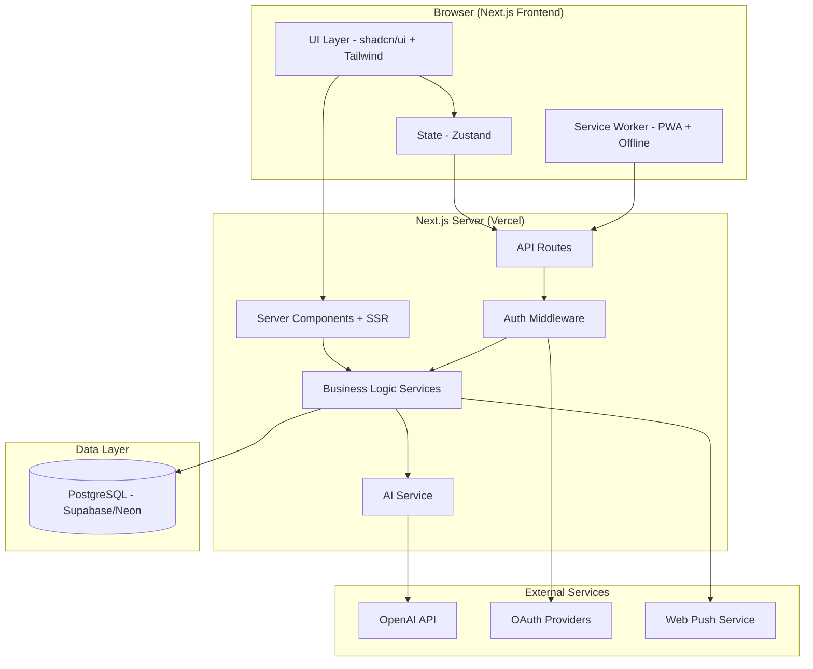
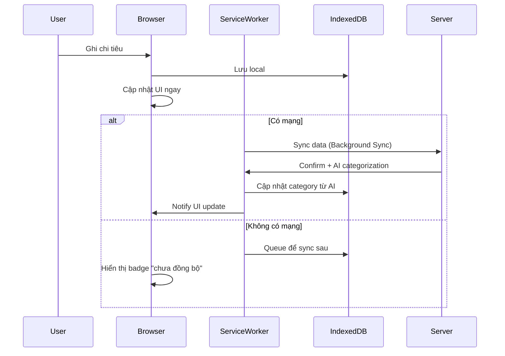
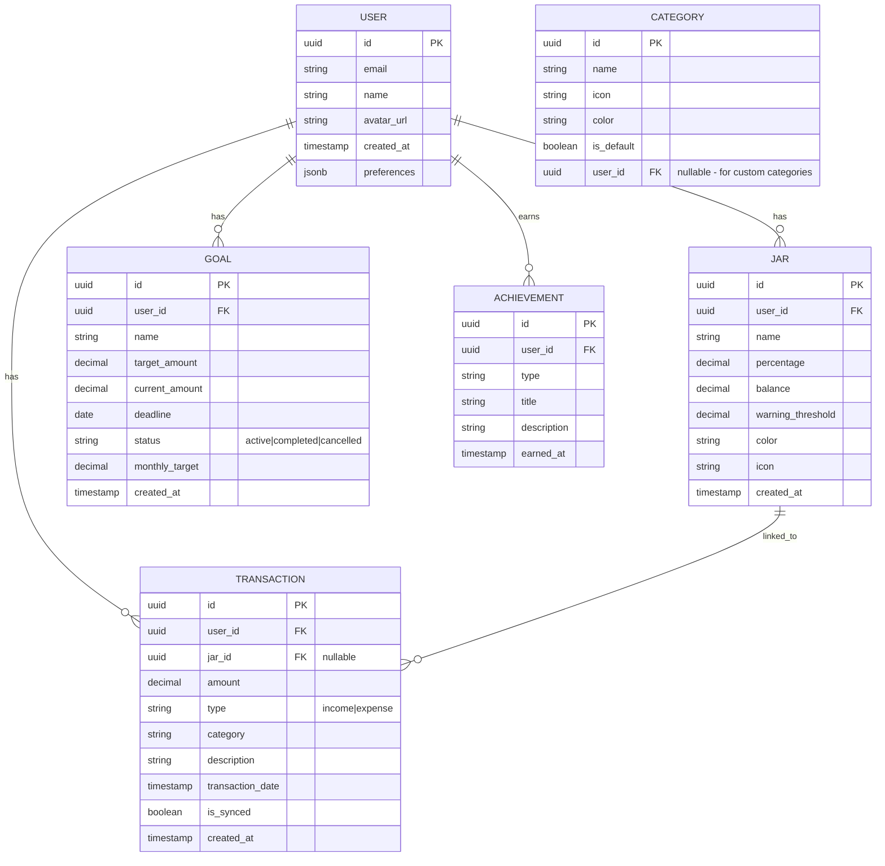

# Design Document - Ứng dụng Quản lý Tài chính Cá nhân

## Overview

Web application quản lý tài chính cá nhân, tập trung vào trải nghiệm nhập liệu nhanh, trực quan hóa dữ liệu, và AI hỗ trợ thông minh. Ứng dụng hướng đến người dùng trẻ (20-35 tuổi) với giao diện hiện đại, tối giản, responsive (mobile-first), và gamification nhẹ để duy trì thói quen. Hỗ trợ PWA để cài đặt trên điện thoại như app native.

## Lựa chọn công nghệ

### Frontend (Web App)
- **Framework:** Next.js 15 (App Router)
  - Lý do: SSR/SSG tối ưu SEO và performance, React ecosystem lớn, API routes tích hợp sẵn
- **UI Library:** shadcn/ui + Tailwind CSS 4
  - Lý do: Customizable, accessible, modern design, không bloat
- **State Management:** Zustand (nhẹ, đơn giản)
- **Charts:** Recharts (React-native, responsive, đẹp)
- **Form:** React Hook Form + Zod validation
- **PWA:** next-pwa (Service Worker, offline support, installable)

### Backend
- **Runtime:** Node.js 22 LTS + TypeScript 5.x
- **Framework:** Next.js API Routes (monorepo, không cần backend riêng)
- **Database:** PostgreSQL 16 (Supabase hoặc Neon)
- **ORM:** Drizzle ORM (type-safe, lightweight, SQL-first)
- **Authentication:** NextAuth.js v5 (Auth.js) — Google, email/password
- **Hosting:** Vercel (frontend + API) + Supabase/Neon (DB)

### AI Integration
- **LLM:** OpenAI GPT-4o-mini (chi phí thấp, đủ mạnh cho phân loại + chat)
- **Approach:** AI-as-a-service qua API routes, không self-host
- **Fallback:** Rule-based categorization khi AI unavailable

### Push Notifications
- **Service:** Web Push API (Service Worker) cho PWA notifications

## Architecture

### Kiến trúc tổng quan



### PWA Offline Strategy



## Components and Interfaces

### API Endpoints (Next.js API Routes)

```
POST   /api/auth/[...nextauth]    (NextAuth.js handles)

GET    /api/transactions?period=month&category=food
POST   /api/transactions
PUT    /api/transactions/[id]
DELETE /api/transactions/[id]

GET    /api/jars
POST   /api/jars
PUT    /api/jars/[id]
POST   /api/jars/[id]/allocate

GET    /api/goals
POST   /api/goals
PUT    /api/goals/[id]
POST   /api/goals/[id]/deposit

GET    /api/reports/summary?period=month
GET    /api/reports/category-breakdown?period=month
GET    /api/reports/trend?months=6

POST   /api/ai/categorize
POST   /api/ai/chat
GET    /api/ai/insights
GET    /api/ai/budget-suggestion
```

### Core Services

| Service | Trách nhiệm |
|---------|-------------|
| TransactionService | CRUD chi tiêu, tính tổng, lọc theo thời gian/danh mục |
| JarService | Quản lý hũ, phân bổ thu nhập, cảnh báo ngưỡng |
| GoalService | Mục tiêu tiết kiệm, tính lộ trình, theo dõi tiến độ |
| ReportService | Tổng hợp báo cáo, so sánh, tạo summary |
| AIService | Phân loại chi tiêu, trả lời câu hỏi, đề xuất ngân sách |
| NotificationService | Web push notification, nhắc nhở, chúc mừng milestone |
| AuthService | Đăng ký, đăng nhập, quản lý session (NextAuth) |

### Web App Pages (Next.js App Router)

| Route | Mô tả |
|-------|--------|
| `/` | Dashboard — tổng quan: chi tiêu hôm nay/tuần/tháng, hũ, mục tiêu |
| `/transactions` | Lịch sử chi tiêu, filter, search |
| `/transactions/new` | Form nhập chi tiêu (quick add modal cũng có trên dashboard) |
| `/jars` | Danh sách hũ tài chính, số dư, phân bổ |
| `/goals` | Mục tiêu tiết kiệm, progress bar |
| `/reports` | Biểu đồ, thống kê, so sánh |
| `/ai` | Chat với AI về tài chính |
| `/settings` | Cài đặt, profile, notification preferences |
| `/onboarding` | 3 bước giới thiệu cho user mới |
| `/login` | Đăng nhập/đăng ký |

### UI Components chính

| Component | Mô tả |
|-----------|--------|
| QuickAddButton | FAB (floating action button) trên mobile, shortcut trên desktop |
| TransactionForm | Form nhập chi tiêu tối giản (amount → category → done) |
| JarCard | Card hiển thị hũ với progress bar và số dư |
| GoalCard | Card mục tiêu với progress ring |
| SpendingChart | Pie chart chi tiêu theo danh mục |
| TrendChart | Line chart xu hướng chi tiêu theo thời gian |
| AIChatBox | Chat interface để hỏi AI |
| AchievementBadge | Badge popup khi đạt milestone |
| SyncIndicator | Hiển thị trạng thái đồng bộ (online/offline/syncing) |

## Data Models

### Entity Relationship



### Drizzle Schema (TypeScript)

```typescript
// schema.ts
import { pgTable, uuid, text, decimal, timestamp, boolean, jsonb, date } from 'drizzle-orm/pg-core';

export const users = pgTable('users', {
  id: uuid('id').primaryKey().defaultRandom(),
  email: text('email').notNull().unique(),
  name: text('name').notNull(),
  avatarUrl: text('avatar_url'),
  preferences: jsonb('preferences').default({}),
  createdAt: timestamp('created_at').defaultNow(),
});

export const transactions = pgTable('transactions', {
  id: uuid('id').primaryKey().defaultRandom(),
  userId: uuid('user_id').references(() => users.id).notNull(),
  jarId: uuid('jar_id').references(() => jars.id),
  amount: decimal('amount', { precision: 12, scale: 2 }).notNull(),
  type: text('type', { enum: ['income', 'expense'] }).notNull(),
  category: text('category').notNull(),
  description: text('description'),
  transactionDate: timestamp('transaction_date').notNull(),
  isSynced: boolean('is_synced').default(true),
  createdAt: timestamp('created_at').defaultNow(),
});

export const jars = pgTable('jars', {
  id: uuid('id').primaryKey().defaultRandom(),
  userId: uuid('user_id').references(() => users.id).notNull(),
  name: text('name').notNull(),
  percentage: decimal('percentage', { precision: 5, scale: 2 }).notNull(),
  balance: decimal('balance', { precision: 12, scale: 2 }).default('0'),
  warningThreshold: decimal('warning_threshold', { precision: 5, scale: 2 }).default('10'),
  color: text('color').notNull(),
  icon: text('icon').notNull(),
  createdAt: timestamp('created_at').defaultNow(),
});

export const goals = pgTable('goals', {
  id: uuid('id').primaryKey().defaultRandom(),
  userId: uuid('user_id').references(() => users.id).notNull(),
  name: text('name').notNull(),
  targetAmount: decimal('target_amount', { precision: 12, scale: 2 }).notNull(),
  currentAmount: decimal('current_amount', { precision: 12, scale: 2 }).default('0'),
  deadline: date('deadline').notNull(),
  status: text('status', { enum: ['active', 'completed', 'cancelled'] }).default('active'),
  monthlyTarget: decimal('monthly_target', { precision: 12, scale: 2 }),
  createdAt: timestamp('created_at').defaultNow(),
});

export const achievements = pgTable('achievements', {
  id: uuid('id').primaryKey().defaultRandom(),
  userId: uuid('user_id').references(() => users.id).notNull(),
  type: text('type').notNull(),
  title: text('title').notNull(),
  description: text('description'),
  earnedAt: timestamp('earned_at').defaultNow(),
});

export const categories = pgTable('categories', {
  id: uuid('id').primaryKey().defaultRandom(),
  name: text('name').notNull(),
  icon: text('icon').notNull(),
  color: text('color').notNull(),
  isDefault: boolean('is_default').default(false),
  userId: uuid('user_id').references(() => users.id),
});
```

### Danh mục mặc định

| Danh mục | Icon | Mô tả |
|----------|------|--------|
| Ăn uống | 🍜 | Cơm, cafe, trà sữa, ăn vặt |
| Di chuyển | 🚗 | Xăng, grab, xe buýt |
| Mua sắm | 🛍️ | Quần áo, đồ dùng |
| Giải trí | 🎮 | Phim, game, du lịch |
| Hóa đơn | 📄 | Điện, nước, internet, điện thoại |
| Sức khỏe | 💊 | Thuốc, khám bệnh, gym |
| Giáo dục | 📚 | Khóa học, sách |
| Khác | 📌 | Không thuộc danh mục nào |

## Error Handling

### Chiến lược xử lý lỗi

| Layer | Cách xử lý |
|-------|------------|
| Network errors | Retry 3 lần với exponential backoff, fallback offline mode (IndexedDB) |
| Validation errors | Hiển thị inline error message (React Hook Form + Zod), highlight field lỗi |
| Auth errors | Auto refresh session (NextAuth), redirect login nếu expired |
| AI errors | Fallback rule-based categorization, toast "AI tạm không khả dụng" |
| Server errors | Hiển thị friendly toast message, log chi tiết phía server |
| Sync conflicts | Last-write-wins với timestamp, notify user nếu có conflict |

### Error Response Format (API)

```typescript
interface ApiError {
  code: string;          // "VALIDATION_ERROR" | "AUTH_ERROR" | "NOT_FOUND" | "SERVER_ERROR"
  message: string;       // Human-readable message (tiếng Việt)
  details?: Record<string, string>; // Field-level errors
}
```

### Offline Handling (PWA)

- Service Worker cache app shell + static assets
- IndexedDB lưu transactions pending sync
- Background Sync API để sync khi có mạng trở lại
- UI hiển thị SyncIndicator component (trạng thái: online/offline/syncing)
- Conflict resolution: server timestamp wins

## Testing Strategy

### Unit Tests
- **Tool:** Vitest (nhanh hơn Jest, tích hợp tốt với Vite/Next.js)
- **Coverage target:** 80% cho business logic (services)
- **Focus:** 
  - Tính toán phân bổ hũ tài chính
  - Tính lộ trình tiết kiệm
  - Validation logic (Zod schemas)
  - AI categorization fallback rules

### Integration Tests
- **Tool:** Vitest + MSW (Mock Service Worker cho API mocking)
- **Focus:**
  - API routes CRUD
  - Auth flow
  - Database queries (Drizzle)
  - AI service integration

### E2E Tests
- **Tool:** Playwright
- **Focus:**
  - Flow ghi chi tiêu (3 click/tap)
  - Onboarding flow
  - Tạo hũ + phân bổ
  - Xem báo cáo
  - Responsive (mobile viewport)

### AI Testing
- **Approach:** Golden dataset với 100+ mẫu chi tiêu đã gán nhãn
- **Metric:** Accuracy phân loại >= 85%
- **Fallback test:** Verify rule-based hoạt động khi AI unavailable

## Quyết định thiết kế quan trọng

| Quyết định | Lý do |
|------------|-------|
| Next.js (web) thay vì React Native (app) | Dễ tiếp cận hơn (không cần cài), deploy nhanh, PWA cho mobile experience |
| Next.js API Routes thay vì backend riêng | Monorepo đơn giản, shared types, deploy 1 chỗ (Vercel) |
| shadcn/ui thay vì MUI/Ant Design | Nhẹ, customizable, không vendor lock-in, accessible |
| Drizzle thay vì Prisma | Nhẹ hơn, SQL-first, type-safe, không cần generate client |
| Zustand thay vì Redux | Boilerplate ít, API đơn giản, đủ cho app scale vừa |
| PWA + IndexedDB | Offline support mà không cần native app, installable trên mobile |
| AI hybrid (LLM + rules) | Giảm chi phí API, đảm bảo hoạt động khi offline |
| Gamification nhẹ | Tăng retention mà không gây phiền, phù hợp target audience |
| PostgreSQL thay vì MongoDB | Dữ liệu tài chính structured, cần ACID, query phức tạp cho reports |
| Vercel hosting | Zero-config deploy cho Next.js, edge functions, free tier đủ dùng |
